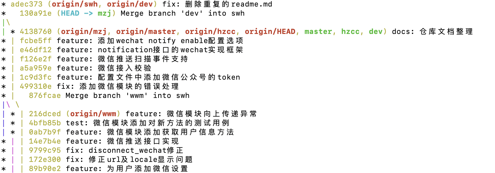

##### 0.实验评分
* 需求说明书：1224
* 反馈质量：1334

---

##### 1.实验六与实验八
* **燃尽图**(DDL：4.30, 下周四)
  - 实验1、实验2
* **结论图**（DDL：5.4 下下周一）
  - 任务主体-个人维度：个人总工时占全体总工时的一张图或者表（也可以是工作量，需要一个指标）
    - 1.首先个人工作量统计表更新到第八周4.24(项目计划进度+个人工作进度)
      - 难度系数、评分
      - 计算公式出的分
  - 任务对象-任务维度：所有任务耗时占比的一张饼图
    - 试试：合并同名任务
  - 分析原因：
    - 文档工作多，代码工作还没有完全开展
    - 解决方案：调高代码比例或者估计一下源码分析的工作量
* **过程图**：（DDL：5.4）
  - 每个实验的个人维度和任务维度图
* 个人每周任务：
  - 【腾讯文档】每周工作计划与进度
https://docs.qq.com/sheet/DWnpNUHBQWk51WENZ
* commit统计放到了实验7
  - 其他图（每周的github commit 柱状图、曲线图等等）

---

##### 2.实验三工作开展
* **设计方案**
  - 下周五
* **进度报告**
  - 下下周三

---
##### 3.git提醒

