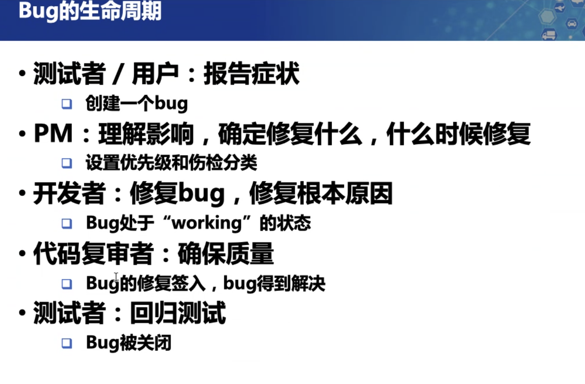
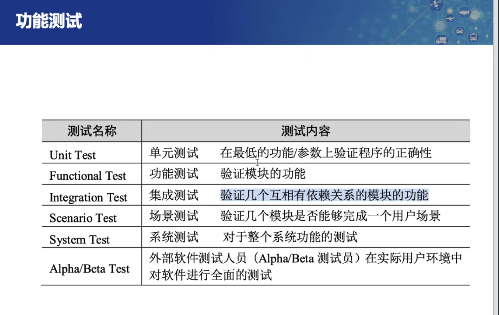
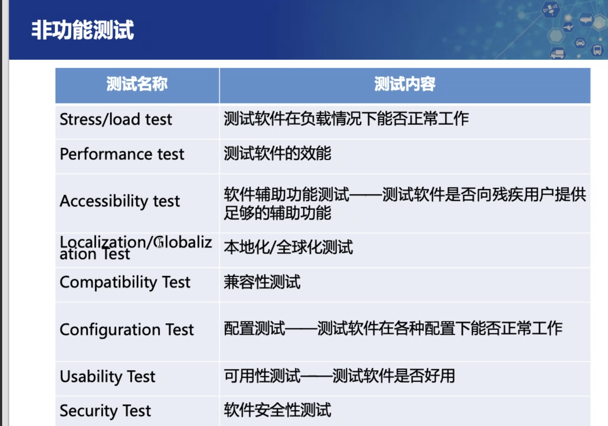
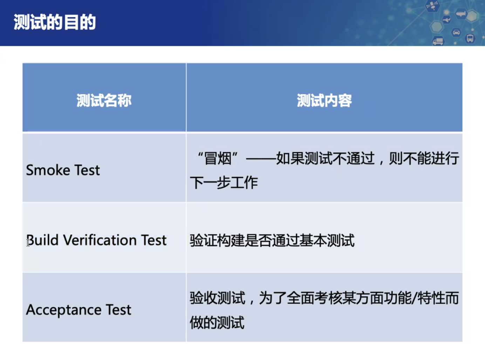
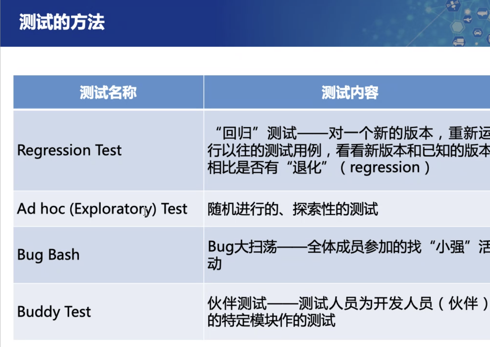
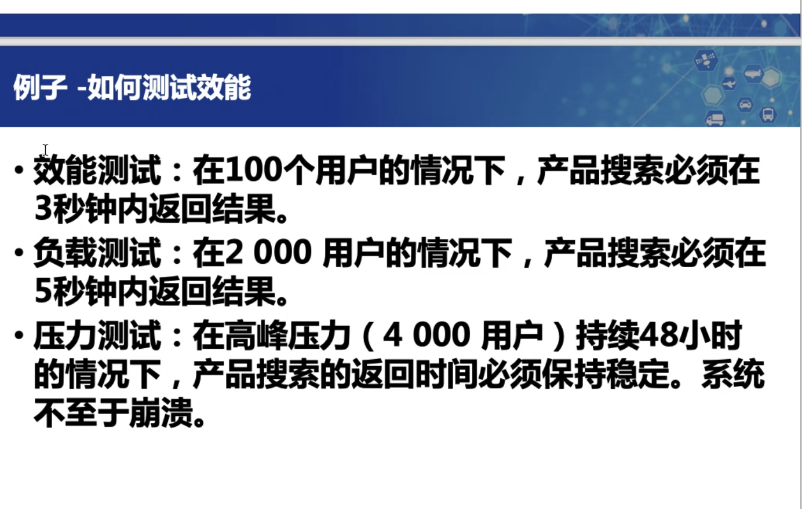
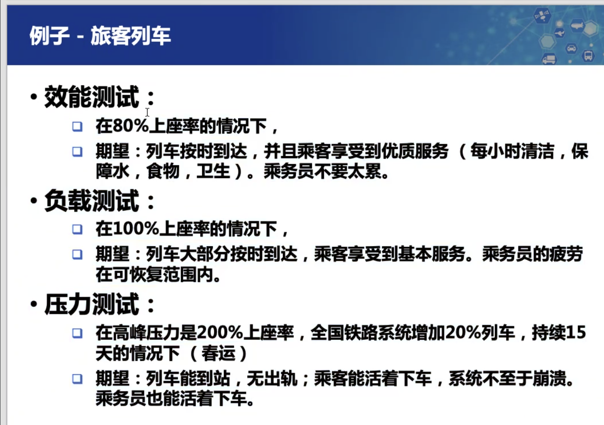

##### 0.测试说明

* 什么是黑盒测试、白盒测试

---
##### 1.本周任务
* 测试工具说明：王伟民
* 测试覆盖表：郑锋
* 测试需求规格说明书更新：王子璇
* 问题报告：麦梓健

---
###### 2.下周任务
* 被测软件，周1下午5点前准备好提供给评审组
  - 怎么交付：
    - 帮助部署在本地
    - 直接开放后台(1)
* 测试需求和测试用例，周2中午12点前提供给评审组
  - 我们的测试用例：
    - 单元测试
    - 功能测试用例
    - 非功能测试用例
* 测试结果，周3中午12点前准备好
  - 联系：我会跟B、C组组长联系确定交付方式和测试方式
* 软件评审报告，软件问题报告，周4中午12点提供给被评测组
  - 周三12点
* 周5中午12点前完成双方对问题的课下交流
* 评审表初稿
  - 周日
* 评审分组：
  - B组：孙维华、王子璇、郑锋
  - C组：麦梓健、王伟民、洪治凑

---
