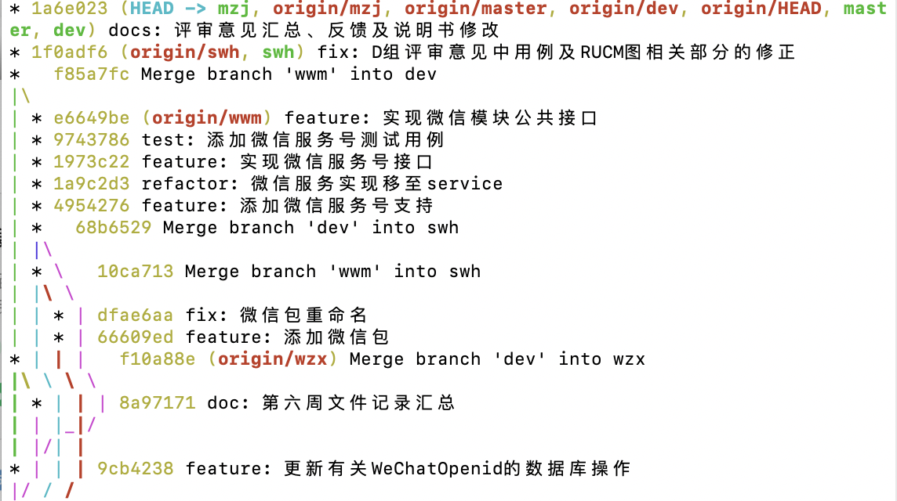

##### 1.实验八思考
* 工作量统计和实验计划的各个表的数据要对的上
* 会议记录和我的项目计划这两个表的再加上commit

##### 2.git commit交流
* vim突然崩溃，是否会造成问题
  - 查询log
  - 重新add、commit
* 每周git进度

* 各自分支更新维护
* 每周分支合并

##### 3.复评审反馈交流
* E组一个问题说，第四章运行环境应当在第五章之后
  - 国标，运行环境应该是属于软件系统属性或者性能需求
  - 看这个运行环境是针对上述的逆向还是我们的功能扩展
