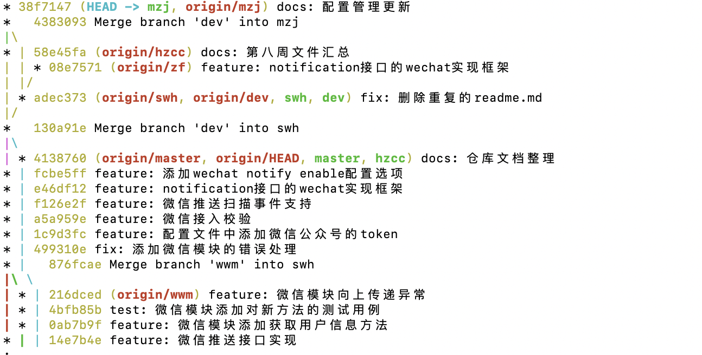

##### 1.燃尽图
* 双线：
  - 计划时间线
  - 实际时间线
* 每个实验阶段需要一张
* 整个实验需要一张

---

##### 2.git log

* 注意更新和分支汇总

---
##### 3.概要设计和进度汇报
* 概要设计：有哪些模块
  - 架构图
  - 模块分析
  - 接口分析，继承关系？
  - 拓展关系
* 进度汇报：汇报内容、方面
  - 工作进度
  - 工作量
  - 代码行数
