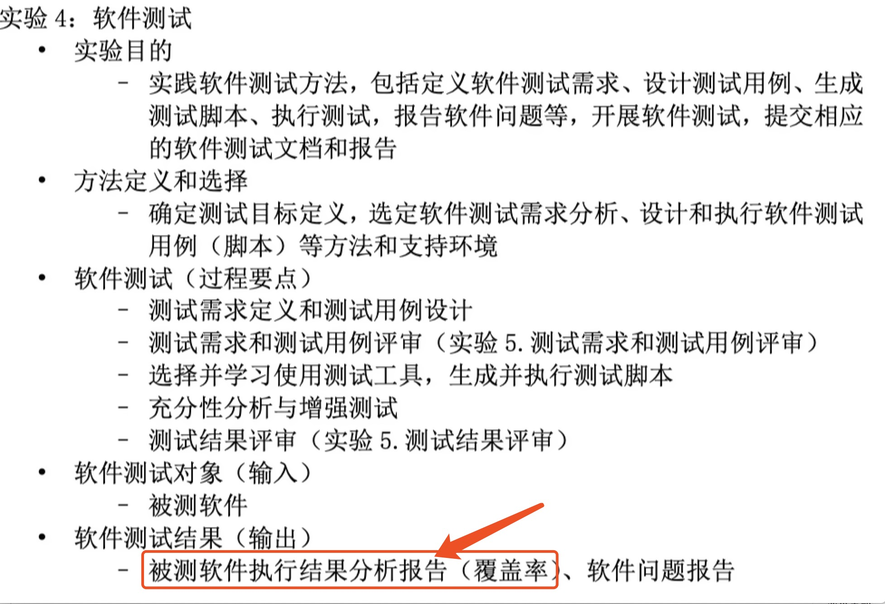
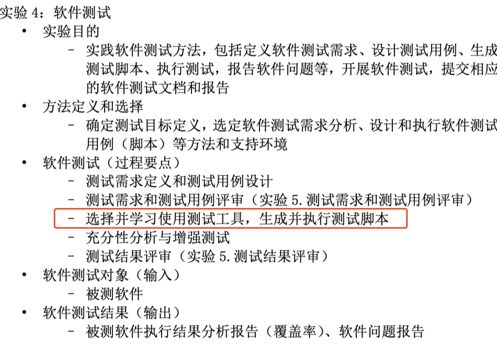
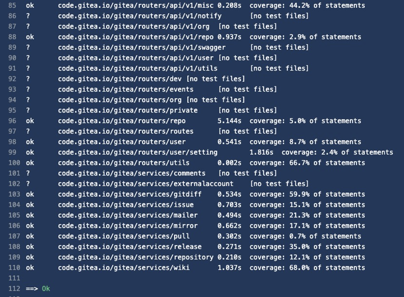
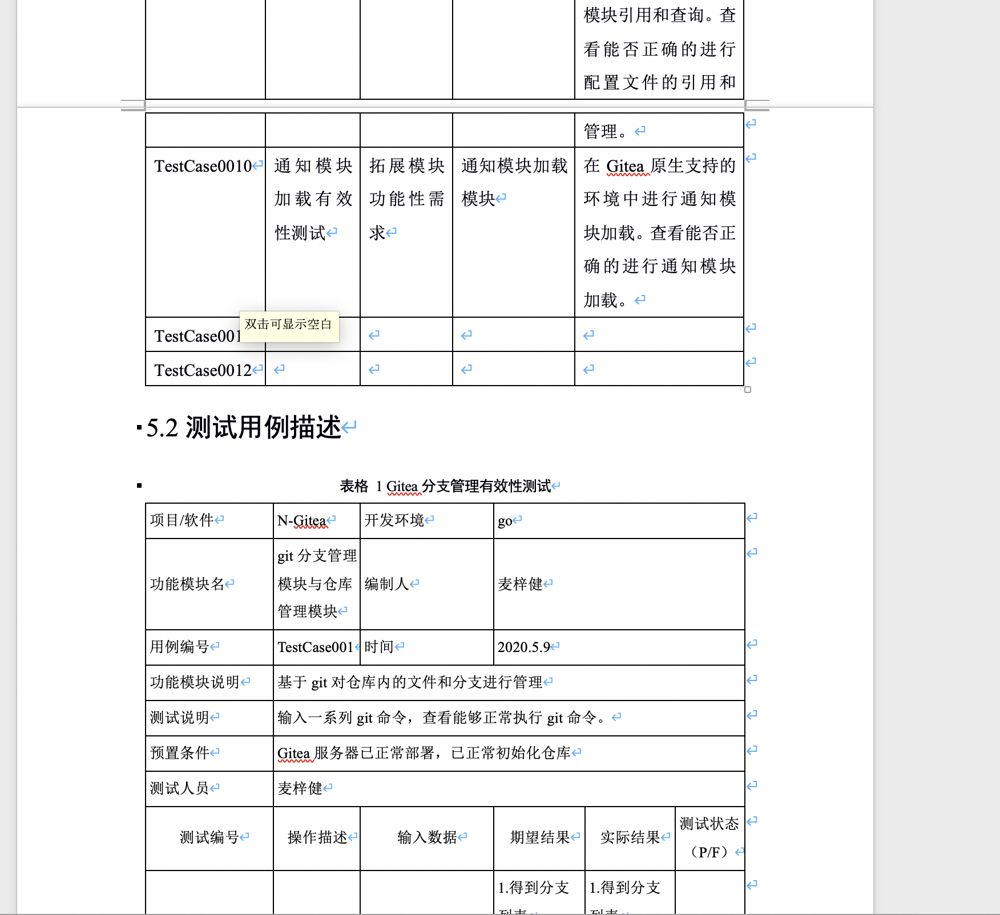
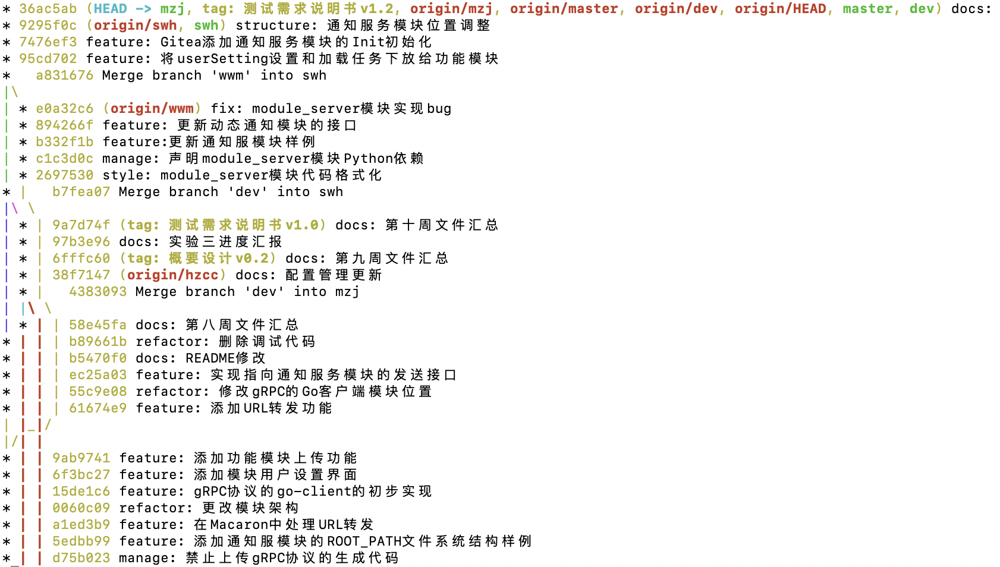

###### 1.测试覆盖表

* 郑锋
* 初稿
  - 测试流程
  - 预测结果

---
###### 2.单元测试

* 大致的要求：
  - 需要使用这个进行一部分测试用例的测试
  - 需要一份简单的报告：介绍这个工具，怎么使用它进行测试的，效果如何
* 形式：
  - 报告形式、不要ppt
* 我们的测试用例还没全写完，go模块的测试可以输出最终的覆盖率的

---
###### 3.测试用例设计

* 将5.1的10个用例扩充成表格1这种形式
* 添加新的测试用例

---
###### 4.Commit情况

