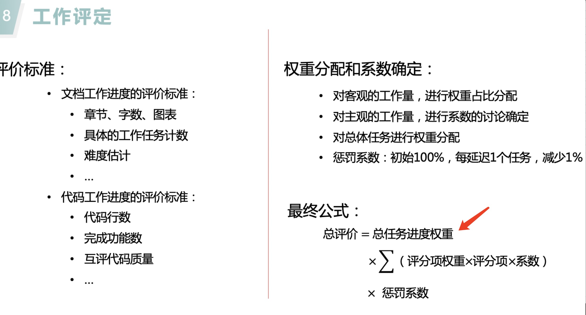

##### 1.实验6-8

* 每个实验拆出来一个表
* 评分细则：
* 总任务进度权重，相当于对每个任务进行权重分配（理解成对各个实验的重要度的评价）
  - 比如说，我实验一软件需求分析占比权重分配20%，实验四软件设计分配20%
  - 软件需求分析20%，输出制品就是需求说明书
    - 可以认为20%的权重都落在上面，也可以分配1-5%在其他任务上面
    - 然后对于需求说明书这些占比，还有很多子项吧。初稿、修改、RUCM用例
    - 这些更细的项，需要用客观量来进行客观占比分析
    - 比如说，整个初稿认为占比10%


---
##### 2.py数据库修改
* 增加删除用户信息功能
  - id timestamp两个参数
  - timestamp需要保持一致才删
* insert 和update都添加一下timestamp的比较
  - insert 需要存储timestamp
  - update比较timestamp是否一致
* 修改sql语句的拼接形式
  - 改为转义形式，防止注入

---
##### 3.go test测试
* 装好go环境之后，在代码根目录运行
```
APPID="wx423cc8097cfd3698" APPSECRET="21db7ea617365ba6c90d6b71a7a62ca1" OPENID="o50Xu50nQg_d3Mr_u6mCxP9TMttE" make unit-test-coverage test-check
```

* 只运行微信模块的单元测试可以在 3-项目源码/services/wechat 目录下运行：
```
APPID="wx423cc8097cfd3698"
APPSECRET="21db7ea617365ba6c90d6b71a7a62ca1" OPENID="o50Xu50nQg_d3Mr_u6mCxP9TMttE"
go test -v -cover
```
