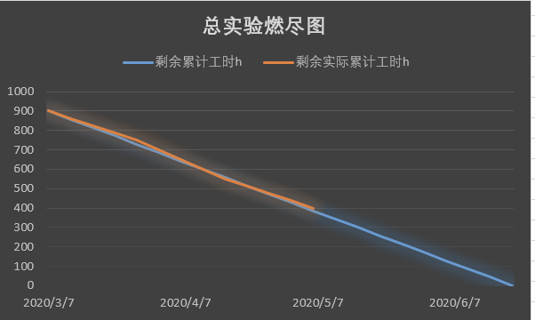
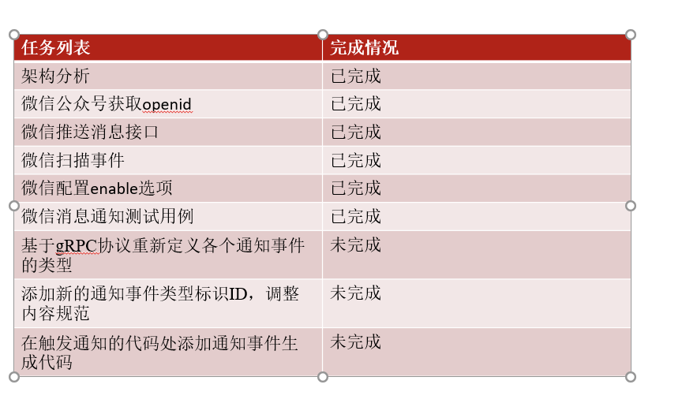
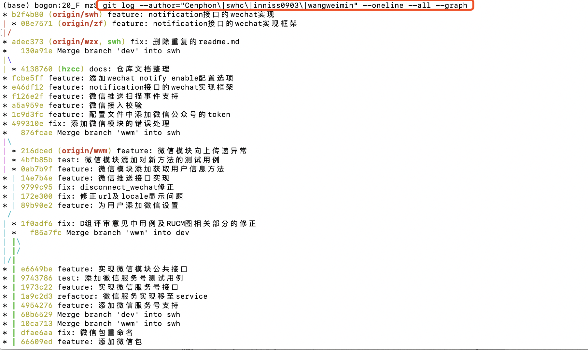

##### 1.数据库操作
* 管理一张表，这张表有index,userid, 然后是各种设置属性字段，需要完成字段的动态添加，以及记录的修改
* db_alter_user_setting就是添加/修改记录
* db_add/del_setting就是添加/删除字段
* db_init(url, port, database, table)改成这个

----
##### 2.阶段总结
* 个人维度把每个人各任务占比图放上去就是六张，任务维度也是6张图，图太多了
* 既然是分析，个人的话就放比较有代表性的比如工时最多和最少的，任务就放耗时最多的两张看每个人的

* 直线的是理想型，匀速推进……
---

##### 3.代码完成状况与进度

